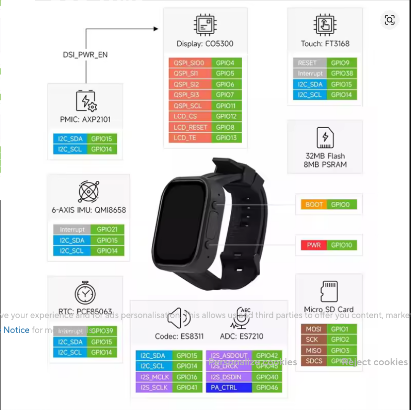

# **ESP32-S3-WATCH-rs**

[ "")](https://github.com/sponsors/QuackHack-McBlindy) [](https://buymeacoffee.com/quackhackmcblindy)




Bare Metal *(no_std)* **ESP32-S3-BOX-3** firmware written in Rust (no `esp-idf`).   
Designed to be used as a voice assistant and/or smart speaker.   
  
> [!CAUTION]
> __Project is under active development!__ <br>
> **Breaking changes will be frequent.**  
<br>


### **Roadmap**

- [x] Async & WiFi
- [x] Buttons & Display (lights up on wake word detection)
- [x] Sensors (presence, temperature, humidity, battery status, ...)
- [x] i2s: RX (Microphone) **FEATURE:** `use_mic` *(default)*
- [x] i2s: TX (Speaker) **FEATURE:** `use_speaker`
- [ ] ⚠️ i2s: Simultaneous RX & TX 
- [x] Voice Command Execution (Wake word, speech to shell command)
- [x] On-Device API
- [x] On-Device WebServer (UI frontend)
- [ ] OTA (auto update from git repo)
- [ ] InfraRed (Send & Recieve)
- [ ] Touch UI (settings, clock, media player, TV remote)
- [ ] Security & WireGuard
- [x] Backend: `yo`

`yo` is not only the backend server service but it's also where you will write your voice commands.  
This is where your `ESP32-S3-BOX-3` microphone audio will be stream  

- [yo](https://github.com/QuackHack-McBlindy/yo)  
  - Wake Word Detection
  - Speech To Text
  - Text To Speech
  - Voice Command Execution


<br>


## **Installation**

<details><summary><strong>
❄️ Using flakes (TODO)
</strong></summary>

*not yet...*

</details>


<details><summary><strong>
📦 Building from source
</strong></summary>


Configure WiFi and other required seetings in the example `.env` file.  

```bash
$ mv .env.example .env
$ nano .env
```


## **Build and flash!**

```bash
cargo run --release
```


</details>


<details><summary><strong>
🐋 Docker (recommended)
</strong></summary>

```bash
$ git clone https://github.com/QuackHack-McBlindy/ESP32-S3-BOX-3-rs
$ cd ESP32-S3-BOX-3-rs
```

Configure WiFi and other required seetings in the example `.env` file.  

```bash
$ mv .env.example .env
$ nano .env
```

`docker-compose.yaml` may require you to change the defined serial port.  
To locate the serial port for use with the `docker-compose.yaml` file you can run the following command:  

```bash
$ ls -l /dev/serial/by-id/
```

**Build and Flash!**

```bash
$ docker compose build
$ docker compose up
```


</details>


<br><br>

## **Flashed - now What?**


#### **Visit Your Device**  


**Web UI**  

Open your browser: `http://<esp-ip>:80`  
*(You will see your device ip in the terminal after flashing)*  

Here you can control and fully utilize all components of the ESP32-S3-BOX-3 from your browser.     
Logs will be at: `http://<esp-ip>:80/logs`  
    
  

#### **API**

The API is designed to be easily expandable, it will most likely grow, best to check [src/api.rs](https://github.com/QuackHack-McBlindy/ESP32-S3-BOX-3-rs/blob/main/src/api.rs) for supported endpoints.    
*or try fetch your available endpoints at:* `curl http://<esp-ip>:80/api`   
  
  
Using the internal API you can for example set the `ESP32-S3-BOX-3` display brightness *(LEDC)* tp 75 percentae using:    


```bash
curl http://<esp-ip>:80/api/settings/display/brightness/75 
```
  

| Endpoint | Description |
|----------|-------------|
| `/` | Serves the web frontend (HTML dashboard) |
| `/favicon.ico` | Serves the favicon (currently returns 404) |
| `/script.js` | Serves the JavaScript frontend logic |
| `/api` | Returns a plain‑text list of all available API endpoints |
| `/api/update` | Trigger OTA firmware update |
| `/api/settings/power/state/{value}` | Control device power: `on`, `off`, or `toggle` (default) |
| `/api/settings/display/state/{value}` | Control display on/off: `on`, `off`, or `toggle` |
| `/api/settings/display/brightness/{value}` | Set backlight brightness (0–80%). `{value}` as integer percent |
| `/api/settings/mic/volume/{value}` | Set microphone gain (0–100%). Returns current volume |
| `/api/settings/mic/mute/{value}` | Mute/unmute mic: `1`/`on`/`mute`, `0`/`off`/`unmute`, or `toggle` |
| `/api/settings/speaker/volume/{value}` | Set speaker volume (0–100%) |
| `/api/settings/speaker/mute/{value}` | Mute/unmute speaker: same options as mic mute |
| `/api/settings/voice/state/{value}` | Voice recording command: `start` or `stop` |
| `/api/voice/detected` | Called when voice is detected; sets brightness to 70% and returns `"OK"` |
| `/api/voice/executed` | Called after a voice command succeeds; sets brightness to 0% and returns `"OK"` |
| `/api/voice/failed` | Called after a voice command fails; sets brightness to 0% and returns `"OK"` |
| `/api/media/{action}` | Media control (e.g., `play`, `pause`, `next`, `prev`) |
| `/api/sensor/{value}` | Read a sensor or system value (see supported keys below) |

### Supported sensor keys for `/api/sensor/{value}`

| Key | Description |
|-----|-------------|
| `temp`, `temperature` | Temperature in °C (e.g., `23.6`) |
| `hum`, `humidity` | Relative humidity in % (e.g., `48`) |
| `battery`, `battery_level`, `battery_percentage` | Battery charge % (e.g., `78`) |
| `battery_voltage`, `voltage` | Battery voltage in V (e.g., `3.84`) |
| `occupancy`, `motion`, `presence` | Occupancy state (`Clear` / `Detected`) |
| `rssi`, `wifi_signal`, `wifi` | Wi‑Fi signal strength in dBm (e.g., `-54`) |
| `ip` | Device IP address (e.g., `192.168.1.122`) |
| `uptime` | System uptime (e.g., `3d 14h`) |
| `firmware`, `version` | Firmware version string (e.g., `v2.1.0`) |


<br><br>


## **HARDARE**

<details><summary><strong>
Specs and GPIO
</strong></summary>

**Display: CO5300**

Screen width: 33.09 mm
Screen height: 40.51 mm

QSPI_SIO0 → GPIO4
QSPI_SI1 → GPIO5
QSPI_SI2 → GPIO6
QSPI_SI3 → GPIO7
QSPI_SCL → GPIO11

LCD_CS → GPIO12
LCD_RESET → GPIO8
LCD_TE → GPIO13

**Touch: FT3168**

RESET → GPIO9
Interrupt → GPIO38
I2C_SDA → GPIO15
I2C_SCL → GPIO14

**PMU: AXP2101**

I2C_SDA → GPIO15
I2C_SCL → GPIO14

(Controlled by DSI_PWR_EN)

**6-Axis IMU: QMI8658**

Interrupt → GPIO21
I2C_SDA → GPIO15
I2C_SCL → GPIO14

**RTC: PCF85063**

Interrupt → GPIO39
I2C_SDA → GPIO15
I2C_SCL → GPIO14

**Audio**

I2C for configuration:
I2C_SDA → GPIO15
I2C_SCL → GPIO14

**Speaker: ES8311**

I2S_ASDOUT → GPIO42
I2S_MCLK → GPIO16
I2S_SCLK → GPIO41

**Microphone: ES7210**

I2S_LRCK → GPIO45
I2S_DSDIN → GPIO40

**Storage**

32MB Flash + 8MB PSRAM

**Micro SD Card**

MOSI → GPIO1
SCK → GPIO2
MISO → GPIO3
SDCS → GPIO? (partially obscured in image, likely GPIO?—appears cut off)

**Buttons / Control**

BOOT → GPIO0
PWR → GPIO10
PA_CTRL → GPIO46

</details>

<details><summary><strong>
DEVICE DIMENSIONS (unit: mm)
</strong></summary>

**Front View**

Overall width: 42.00 mm
Overall height: 50.80 mm
Screen width (inner): 33.09 mm
Screen height (inner): 40.51 mm
Corner radius: R9.2

**Side View**

Thickness (main body): 12.90 mm
Maximum thickness: 13.60 mm

**Back View**

Top section width: 22.00 mm
Bottom section width: 22.00 mm
Label: ESP32-S3-Touch-AMOLED-2.06

**Strap**

Total length: 250.00 mm
Strap width: 22.00 mm

</details>


<br><br>


## **☕**

[ "")](https://github.com/sponsors/QuackHack-McBlindy) [](https://buymeacoffee.com/quackhackmcblindy)
> 🦆🧑‍🦯 says ⮞ Hi! I'm QuackHack-McBlindy!  
> 🦆🧑‍🦯 says ⮞ Like my work?  
> Buy me a coffee, or become a sponsor.  
> Thanks for supporting open source/hungry developers ♥️🦆!   

♥️₿ *Donate crypto? Wallet:* `pungkula.x`  
<a href="https://www.buymeacoffee.com/quackhackmcblindy" target="_blank"></a>


<br>

## **Lisence**

**MIT**  
